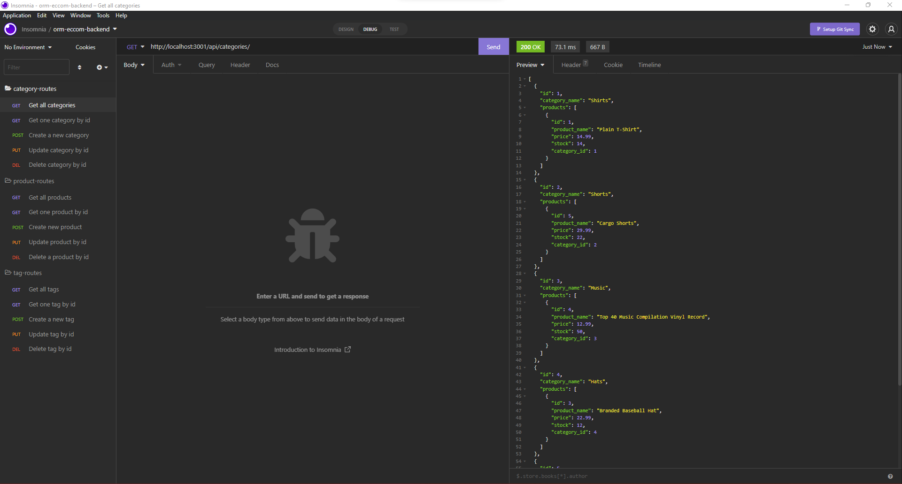

# orm-ecomm-backend

## Description

This project was to build a backend for an e-commerce site by configuring a working Express.js API using Sequelize to interact with a MySQL database.

This app uses:

- Node.js
- Sequelize
- Express.js
- MySQL

## Table of Contents

- [Installation](#installation)
- [Appearance](#appearance)
- [License](#license)
- [Questions](#questions)

## Installation

You will need to have Node.js and MySQL already installed on your computer. I use insomnia to test the routes.

[Install Node](https://nodejs.org/en/download/)

[Install MySQL](https://dev.mysql.com/doc/mysql-shell/8.0/en/mysql-shell-install.html)

1. Navigate to the "<> Code" tab of the project.
1. Click on the "Code" button on the right. A dropdown should appear.
1. Under "Clone", "HTTPS" should be selected.
1. Select "Download ZIP"
1. Extract the folder to where you'd like to save orm-ecomm-backend.
1. Locate and create a copy of the `.env.EXAMPLE` within the orm-ecomm-backend folder.
1. Rename the copy `.env`.
1. Open the `.env` file and fill in `DB_PASSWORD=` with your MySQL password and `DB_USER=` with your MySQL username.
1. Using your console, navigate to the folder.
1. Once inside the folder in your console run the below command to install required node modules.

   `npm install`

1. You will need to source the database as well. You should already have MySQL installed. In your console, run the below command.

   `mysql -u root -p`

1. You will be prompted to enter your MySQL password.
1. Once inside the SQL shell, run the below command.

   `source db\schema.sql;`

1. If you would like to have test data already in the database, run the below command in your console. Otherwise, skip this step.

   `npm run seed`

1. The orm-ecomm-backend is ready for use.

## Appearance

[Walk-through Video](https://youtu.be/6Bt5ox2zUt0)

Screenshot:

## License

See the [LICENSE](LICENSE.md) file for license rights and limitations (MIT License).

## Questions

Feel free to reach me on [GitHub](https://github.com/struelensc).
